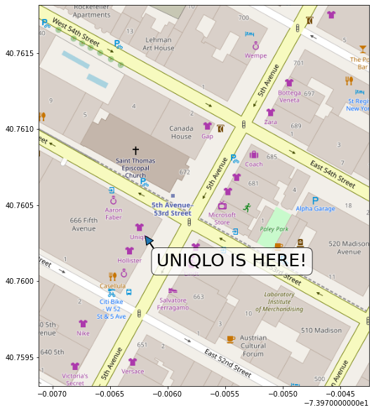
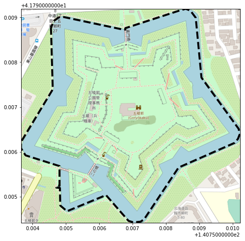
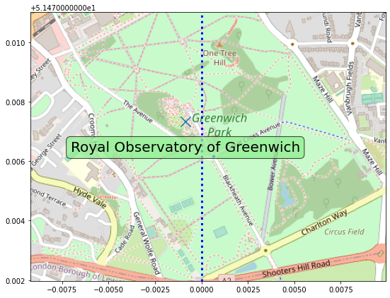
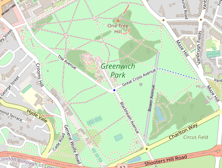
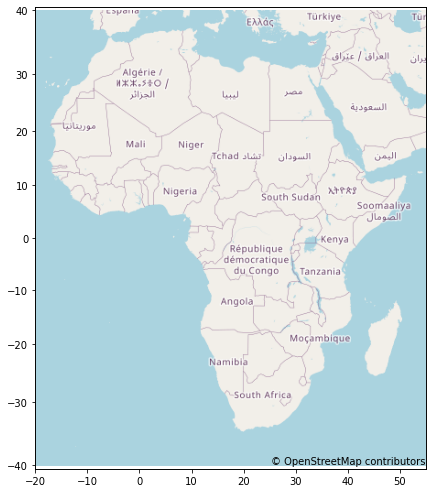
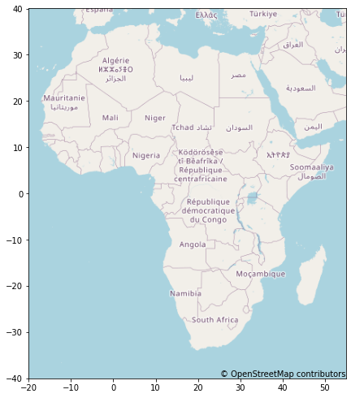

maptiles
===========
[](https://badge.fury.io/py/maptiles)

Create map images and use as plot background.


## Installation

```shell
# from pypi
$ pip3 install maptiles

# alternatively, from github
$ git clone https://github.com/kota7/maptiles.git --depth 1
$ pip3 install -U ./maptiles
```


## Illustrative examples

### Map image on matplotlib axes

- `draw_map((lon1, lat1, lon2, lat2))` draws the map image of the specified rectangle behind the matplotlib axes.
- Visualizations can be added further using the matplotlib features

**Remarks:**

- Longitude and latitudes must be given in angles. Internally longitudes are converted to `[-180 to 180)` scale. Latitudes must be in `[-L, L]` with `L=85.0511287798`. This `L` is the north and south limit of Web Mercator projection.
- Zoom level is automatically chosen by heuristic calculation. The `z` option allows for explicit specification.
- Aspect ratio is automatically adjusted by heuristic calculation. The `aspect` option allows for explicit specification.
- If `ax` is not given, then a new axes is created internally.
- The axes will be scaled by Web Mercator formula comaptible with the image.


```python
from maptiles import draw_map

# 5th Avenue in Manhattan, New York
bounds = [286.02288365364075, 40.761816905893156, 286.0257428884506, 40.7593098808893]
fig, ax = plt.subplots(figsize=(10, 10))
draw_map(bounds, ax=ax)

uniqlo = [286.02380633354187, 40.76029726182907]
uniqlo[0] -= 360
arrow_from = uniqlo[0] + 0.0001, uniqlo[1] - 0.0002
ax.annotate("UNIQLO IS HERE!", uniqlo, xytext=arrow_from, fontsize=25,
            bbox={"facecolor": "white", "alpha":0.75, "boxstyle":"round"}, arrowprops={"width":1})
None
```

    Zoom level 18 is chosen


    

    


```python
# Goryokaku Castle in Hokkaido, Japan
goryokaku = [[140.7545506954193, 41.79877552882002], [140.7546043395996, 41.797391817910004], [140.7536494731903, 41.7962160400744],
             [140.7536494731903, 41.79608006437536], [140.75378894805905, 41.79592009259535], [140.75480818748474, 41.79568013417667],
             [140.75480818748474, 41.79524020807576], [140.75473308563232, 41.79524820675909], [140.7547116279602, 41.79520021464413],
             [140.7548189163208, 41.79519221595479], [140.75482964515686, 41.7948002789552], [140.755033493042, 41.79467229900768],
             [140.75620293617249, 41.79503224195874], [140.75687885284424, 41.794456332266776], [140.75702905654907, 41.79442433713216],
             [140.75724363327026, 41.79444033470147], [140.75735092163086, 41.79449632616259], [140.75838088989255, 41.795648139652975],
             [140.76006531715393, 41.79620004294831], [140.76016187667847, 41.796288027092395], [140.76021552085876, 41.79639200819787],
             [140.7601833343506, 41.79651198618687], [140.75906753540036, 41.7976557650716], [140.75889587402344, 41.79899148100668],
             [140.75873494148254, 41.79915144512023], [140.75859546661377, 41.79919143608624], [140.7584023475647, 41.79915144512023],
             [140.7567822933197, 41.798759532332795], [140.7567822933197, 41.79872753934637], [140.75671792030334, 41.79872753934637],
             [140.75493693351746, 41.79900747743603], [140.75478672981262, 41.79899947922184], [140.75464725494385, 41.798927495249465],
             [140.7545506954193, 41.79877552882002]]
lons, lats = zip(*goryokaku)
bounds = min(lons), max(lats), max(lons), min(lats)
fig, ax = plt.subplots(figsize=(8, 8))
draw_map(bounds, ax=ax)

ax.plot(lons, lats, c="black", linewidth=4, linestyle="dashed")
None
```

    Zoom level 17 is chosen


    

    


```python
# Royal observatory of Greenwich
bounds = (-0.0092, 51.481, 0.0099, 51.472)
fig, ax = plt.subplots(figsize=(9, 7.2))
draw_map(bounds, ax=ax)

observatory = (-0.0008717179298400879, 51.47732699342673)
ax.scatter(*observatory, marker="x", s=200)
ax.axvline(x=0, linestyle="dotted", linewidth=3, c="blue")
ax.text(observatory[0], observatory[1]-0.001, "Royal Observatory of Greenwich", ha="center",
        fontsize=20, bbox={"facecolor":"lightgreen", "alpha":0.75, "boxstyle":"round"})
None
```

    Zoom level 15 is chosen


    

    


## Obtain the image data as array

- `get_maparray((lon1, lat1, lon2, lat2))` returns:
    - The RGB image data as numpy array of shape (height, height, 3).
    - Tuple of `(xmin, xmax, ymin, ymax)` defining the area covered by the image.


```python
from maptiles import get_maparray
# Royal observatory of Greenwich, again
bounds = (-0.0092, 51.481, 0.0099, 51.472)
img, extent = get_maparray(bounds)

print(img.shape)
print(extent)

Image.fromarray(img)
```

    (338, 446, 3)
    (-0.009226799011230469, 0.009913444519042969, 51.47197425351905, 51.48100872578421)


    Zoom level 15 is chosen


    

    


## Tiles

### Predefined tiles

- This package defines a number of map tiles for the convenience.
- The available tiles are given by the `predefined_tiles` function.
- `get_tile` function returns the predefined tile object (a named tuple).
- The `tile` option of `draw_map` and `get_maparray` accepts one of:
    - Names of predefined tiles.
    - URL string with `{z}`, `{x}`, `{y}` format parameters.
    - Tile object.


```python
from maptiles import predefined_tiles, get_tile

list(predefined_tiles().keys())
get_tile("osm")
```


    Tile(name='OpenStreetMap, Standard', baseurl='https://tile.openstreetmap.org/{z}/{x}/{y}.png', copyright='© OpenStreetMap contributors', copywright_html='&copy; <a href="http://openstreetmap.org">OpenStreetMap</a> contributors')


```python
# Royal observatory of Greenwich, again
bounds = (-0.0092, 51.481, 0.0099, 51.472)
fig, ax = plt.subplots(1, 2, figsize=(13, 5.2))
draw_map(bounds, ax=ax[0], tile="google")   # tile name
ax[0].set_title("Google Map")

draw_map(bounds, ax=ax[1], tile=get_tile("osm_bw")) # tile object
ax[1].set_title("OpenStreetMap Black&White")
fig.tight_layout()
None
```

    Zoom level 15 is chosen
    Zoom level 15 is chosen


    

    


### Copyrights of the map tiles

- This package only provides an interface to access and parse data from map tile servers.
- The map data belong to the providers and they shall be used in compliant with their term of usage.
- Examples of copyright messages are given for predefined tiles (Note: not official one).
- Use `get_tile` function to use them.


```python
from IPython.core.display import HTML

tile = get_tile("osm")
print(tile.copyright)
display(HTML(tile.copywright_html))

tile = get_tile("japangsi")
print(tile.copyright)
display(HTML(tile.copywright_html))

tile = get_tile("google")
print(tile.copyright)
display(HTML(tile.copywright_html))
```

    © OpenStreetMap contributors


&copy; <a href="http://openstreetmap.org">OpenStreetMap</a> contributors


    © 国土地理院 | Geospatial Information Authority of Japan


&copy; <a href="https://maps.gsi.go.jp/development/ichiran.html">国土地理院 | Geospatial Information Authority of Japan</a>


    © Google


&copy; <a href="https://google.com">Google</a>


```python
# Add copyright message to the plot
bounds = [-20, 40, 55, -40]
tile = get_tile("osm")
fig, ax = plt.subplots(figsize=(7, 8.5))
draw_map(bounds, ax=ax, tile=tile)
bottom, right = ax.get_ylim()[0], ax.get_xlim()[1]
ax.text(right, bottom, tile.copyright, ha="right", va="bottom")
None
```

    Zoom level 3 is chosen


    

    


### Custom tiles

- Any tile following the OSM's naming rule can be specified by a URL string with `{x}`, `{y}`, `{z}` parameters.
- Alternatively, a tile object can be created with the `Tile` function.


```python
from maptiles import Tile

# Mount Fuji, Japan
bounds = [138.53553771972656, 35.48024245154482, 138.9276123046875, 35.231598543453316]
fig, ax = plt.subplots(1, 2, figsize=(15, 5.6))

draw_map(bounds, ax=ax[0], tile="https://cyberjapandata.gsi.go.jp/xyz/english/{z}/{x}/{y}.png")
draw_map(bounds, ax=ax[1], tile=Tile("https://cyberjapandata.gsi.go.jp/xyz/seamlessphoto/{z}/{x}/{y}.jpg"))
None
```

    Zoom level 11 is chosen
    Zoom level 11 is chosen


    

    

    


## Implementation details


### Coordinate Projection

#### (longitude, latitude) to (Pixel Index)

Longitude and latitude are converted to pixel index by the following formulas.

```
lonToPixel(x) = 2^(z+7) * (x/180 + 1)
latToPixel(y) = 2^(z+7)/pi * ( -atanh(sin(pi*y/180)) + atanh(sin(pi*L/180)) )
```

These pixel indices are used to find the tile images corresponding to the coordinates, and also identify the locations within the image.
The collected tile images are concatenated and cropped to form a single image as close as possible to the desired area.

### Database

- Downloaded image data are stored at the internal SQLite database at `config.dbfile`. The default location is `~/maptiles.db`.
- By reusing the stored images, we reduce the number of requests to the map tile servers.
- If you want to delete existing data, either run `initialize_database(replace=True)` or simply delete the file.
- One may change the database file location by the `set_databasefile` function.


```python
import sqlite3
from maptiles import config, set_databasefile

# The database has only one table "tiles"
#   with columns "url" and "image".
with sqlite3.connect(config.dbfile) as conn:
    c = conn.cursor()
    data = c.execute("SELECT url FROM tiles LIMIT 10").fetchall()
print(data)
```

    [('http://tiles.wmflabs.org/bw-mapnik/15/16383/10900.png',),
     ('http://tiles.wmflabs.org/bw-mapnik/15/16383/10901.png',),
     ('http://tiles.wmflabs.org/bw-mapnik/15/16384/10900.png',),
     ('http://tiles.wmflabs.org/bw-mapnik/15/16384/10901.png',),
     ('https://cyberjapandata.gsi.go.jp/xyz/seamlessphoto/11/1812/807.jpg',),
     ('https://cyberjapandata.gsi.go.jp/xyz/seamlessphoto/11/1812/808.jpg',),
     ('https://cyberjapandata.gsi.go.jp/xyz/seamlessphoto/11/1812/809.jpg',),
     ('https://cyberjapandata.gsi.go.jp/xyz/seamlessphoto/11/1813/807.jpg',),
     ('https://cyberjapandata.gsi.go.jp/xyz/seamlessphoto/11/1813/808.jpg',),
     ('https://cyberjapandata.gsi.go.jp/xyz/seamlessphoto/11/1813/809.jpg',)]


```python
# Change the database location
set_databasefile("./temp.db")
print(config.dbfile)
```

    ./temp.db
