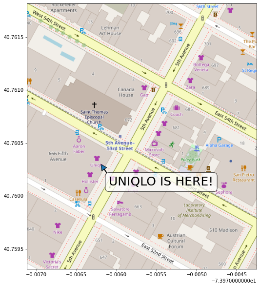
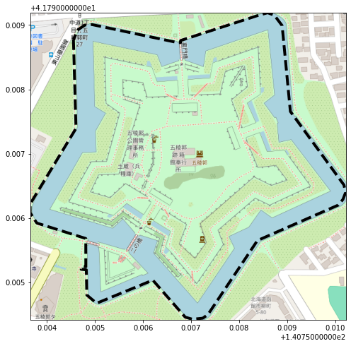
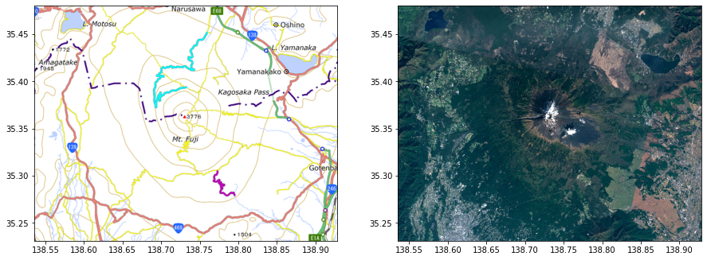

maptiles
===========
[](https://badge.fury.io/py/maptiles)

Create map images and use as plot background.


## Installation

```shell
# from pypi
$ pip3 install maptiles

# alternatively, from github
$ git clone https://github.com/kota7/maptiles.git --depth 1
$ pip3 install -U ./maptiles
```

## Illustrative examples

### Map image on matplotlib axes

- `draw_map((lon1, lat1, lon2, lat2))` draws the map image of the specified rectangle behind the matplotlib axes.
- The function returns a tuple of an `Axes` (the same object if `ax` argument is supplied) and `AxesImage` object of the map image.
- Visualizations can be added further using the matplotlib features.

**Remarks:**

- Longitude and latitudes must be given in angles. Internally longitudes are converted to `[-180 to 180)` scale. Latitudes must be in `[-L, L]` with `L=85.0511287798`. This `L` is the north and south limit of Web Mercator projection.
- Zoom level is automatically chosen by heuristic calculation. The `z` option allows for explicit specification.
- Aspect ratio is automatically adjusted by heuristic calculation. The `aspect` option allows for explicit specification.
- If `ax` is not given, then a new axes is created internally.
- The axes will be scaled by Web Mercator formula comaptible with the image.


```python
from maptiles import draw_map

# 5th Avenue in Manhattan, New York
bounds = [286.02288365364075, 40.761816905893156, 286.0257428884506, 40.7593098808893]
fig, ax = plt.subplots(figsize=(10, 10))
draw_map(bounds, ax=ax)

uniqlo = [286.02380633354187, 40.76029726182907]
uniqlo[0] -= 360
arrow_from = uniqlo[0] + 0.0001, uniqlo[1] - 0.0002
ax.annotate("UNIQLO IS HERE!", uniqlo, xytext=arrow_from, fontsize=25,
            bbox={"facecolor": "white", "alpha":0.75, "boxstyle":"round"}, arrowprops={"width":1})
None
```

    Zoom level 18 is chosen


    

    


```python
# Goryokaku Castle in Hokkaido, Japan
goryokaku = [[140.7545506954193, 41.79877552882002], [140.7546043395996, 41.797391817910004], [140.7536494731903, 41.7962160400744],
             [140.7536494731903, 41.79608006437536], [140.75378894805905, 41.79592009259535], [140.75480818748474, 41.79568013417667],
             [140.75480818748474, 41.79524020807576], [140.75473308563232, 41.79524820675909], [140.7547116279602, 41.79520021464413],
             [140.7548189163208, 41.79519221595479], [140.75482964515686, 41.7948002789552], [140.755033493042, 41.79467229900768],
             [140.75620293617249, 41.79503224195874], [140.75687885284424, 41.794456332266776], [140.75702905654907, 41.79442433713216],
             [140.75724363327026, 41.79444033470147], [140.75735092163086, 41.79449632616259], [140.75838088989255, 41.795648139652975],
             [140.76006531715393, 41.79620004294831], [140.76016187667847, 41.796288027092395], [140.76021552085876, 41.79639200819787],
             [140.7601833343506, 41.79651198618687], [140.75906753540036, 41.7976557650716], [140.75889587402344, 41.79899148100668],
             [140.75873494148254, 41.79915144512023], [140.75859546661377, 41.79919143608624], [140.7584023475647, 41.79915144512023],
             [140.7567822933197, 41.798759532332795], [140.7567822933197, 41.79872753934637], [140.75671792030334, 41.79872753934637],
             [140.75493693351746, 41.79900747743603], [140.75478672981262, 41.79899947922184], [140.75464725494385, 41.798927495249465],
             [140.7545506954193, 41.79877552882002]]
lons, lats = zip(*goryokaku)
bounds = min(lons), max(lats), max(lons), min(lats)
fig, ax = plt.subplots(figsize=(8, 8))
draw_map(bounds, ax=ax)

ax.plot(lons, lats, c="black", linewidth=4, linestyle="dashed")
None
```

    Zoom level 17 is chosen


    

    


```python
# Royal observatory of Greenwich
bounds = (-0.0092, 51.481, 0.0099, 51.472)
fig, ax = plt.subplots(figsize=(9, 7.2))
draw_map(bounds, ax=ax)

observatory = (-0.0008717179298400879, 51.47732699342673)
ax.scatter(*observatory, marker="x", s=200)
ax.axvline(x=0, linestyle="dotted", linewidth=3, c="blue")
ax.text(observatory[0], observatory[1]-0.001, "Royal Observatory of Greenwich", ha="center",
        fontsize=20, bbox={"facecolor":"lightgreen", "alpha":0.75, "boxstyle":"round"})
None
```

    Zoom level 15 is chosen


    

    


## Obtain the image data as array

- `get_maparray((lon1, lat1, lon2, lat2))` returns:
    - The RGB image data as numpy array of shape (height, height, 3).
    - Tuple of `(xmin, xmax, ymin, ymax)` defining the area covered by the image.


```python
from maptiles import get_maparray
# Royal observatory of Greenwich, again
bounds = (-0.0092, 51.481, 0.0099, 51.472)
img, extent = get_maparray(bounds)

print(img.shape)
print(extent)
Image.fromarray(img)
```

    (338, 446, 3)
    (-0.009226799011230469, 0.009913444519042969, 51.47197425351887, 51.481008725784044)


    Zoom level 15 is chosen


    

    


## Tiles

### Predefined tiles

- This package defines a number of map tiles for the convenience.
- The available tiles are given by the `predefined_tiles` function.
- `get_tile` function returns the predefined tile object (a named tuple).
- The `tile` option of `draw_map` and `get_maparray` accepts the followings:
    - Name of a predefined tile.
    - URL string with `{z}`, `{x}`, `{y}` format parameters.
    - `Tile` object.


```python
from maptiles import predefined_tiles, get_tile

list(predefined_tiles().keys())
```

    ['osm', 'osm_bw', 'osm_tonner', 'osm_tonner_hybrid', 'osm_tonner_labels',
     'osm_tonner_lines', 'osm_tonner_background', 'osm_tonner_lite',
     'japangsi', 'japangsi_pale', 'japangsi_blank',
     'google', 'google_roads', 'google_streets', 'google_terrain', 'google_satellite', 'google_satellite_hybrid',
     'google_h', 'google_r', 'google_t', 'google_s', 'google_y']


```python
get_tile("osm")
```


    Tile(name='OpenStreetMap, Standard',
         baseurl='https://tile.openstreetmap.org/{z}/{x}/{y}.png',
         copyright='© OpenStreetMap contributors',
         copyright_html='&copy; <a href="http://openstreetmap.org">OpenStreetMap</a> contributors')


```python
# Arc de Triomphe in Paris
bounds = (2.2890830039978023, 48.87102408096251, 2.301185131072998, 48.87695157541353)
fig, ax = plt.subplots(1, 2, figsize=(13, 6))
draw_map(bounds, ax=ax[0], tile="google_streets")   # tile name
ax[0].set_title("Google Street")

draw_map(bounds, ax=ax[1], tile=get_tile("osm_bw")) # tile object
ax[1].set_title("OpenStreetMap Black&White")
fig.tight_layout()
None
```

    Zoom level 16 is chosen
    Zoom level 16 is chosen


    

    


### Copyrights of the map tiles

- This package only provides an interface to access and parse data from map tile servers.
- The map data belong to the providers and they shall be used in compliant with their term of usage.
- Examples of copyright messages are given for predefined tiles (Note: not official one).
- Use `get_tile` function to use them.


```python
from IPython.core.display import HTML

tile = get_tile("osm")
print(tile.copyright)
display(HTML(tile.copyright_html))

tile = get_tile("japangsi")
print(tile.copyright)
display(HTML(tile.copyright_html))

tile = get_tile("google")
print(tile.copyright)
display(HTML(tile.copyright_html))
```

    © OpenStreetMap contributors


&copy; <a href="http://openstreetmap.org">OpenStreetMap</a> contributors


    © 国土地理院 | Geospatial Information Authority of Japan


&copy; <a href="https://maps.gsi.go.jp/development/ichiran.html">国土地理院 | Geospatial Information Authority of Japan</a>


    © Google


&copy; <a href="https://google.com">Google</a>


```python
# Add copyright message to the plot
bounds = [-20, 40, 55, -40]
tile = get_tile("osm")
fig, ax = plt.subplots(figsize=(7, 8.5))
draw_map(bounds, ax=ax, tile=tile)
bottom, right = ax.get_ylim()[0], ax.get_xlim()[1]
ax.text(right, bottom, tile.copyright, ha="right", va="bottom")
None
```

    Zoom level 3 is chosen


    

    


### Custom tiles

- Any tile following the OSM's naming rule can be specified by a URL string with `{x}`, `{y}`, `{z}` parameters.
- Alternatively, a tile object can be created with the `Tile` function.


```python
from maptiles import Tile

# Mount Fuji, Japan
bounds = [138.53553771972656, 35.48024245154482, 138.9276123046875, 35.231598543453316]
fig, ax = plt.subplots(1, 2, figsize=(15, 5.6))

draw_map(bounds, ax=ax[0], tile="https://cyberjapandata.gsi.go.jp/xyz/english/{z}/{x}/{y}.png")
draw_map(bounds, ax=ax[1], tile=Tile("https://cyberjapandata.gsi.go.jp/xyz/seamlessphoto/{z}/{x}/{y}.jpg"))
None
```

    Zoom level 11 is chosen
    Zoom level 11 is chosen


    

    


## Web Mercator projection

- This package assumes that map tiles are [Web Mercator projected](https://en.wikipedia.org/wiki/Web_Mercator_projection).
- The Web Mercator is a simplified version of Mercator projection and widely used by standard web maps currently, including the Google Map and OpenStreetMap.
- The projection formula is the following:
    $$
    \begin{align}
    x &= \frac{2^{z+7}}{\pi} (\lambda + \pi) \\
    y &= \frac{2^{z+7}}{\pi} \left(\pi - \mathrm{tanh}^{-1}(\mathrm{sin}\; \phi)\right)
    \end{align}
    $$
    where $\lambda, \phi$ are longitude and latitude in radians, and $x, y$ are pixel indices on the web map images. $z$ is the zoom level.
- Since the latitude conversion is non-linear, simply plotting (lon, lat) as (x, y) coordinates would deviate from the map, since it is already in the Web Mercator scale.
- We may think of following three strategies to this issue:

|    | Strategy                                                  | Pros                                         | Cons                                                           | Parameters to draw_map         |
|----|-----------------------------------------------------------|----------------------------------------------|----------------------------------------------------------------|---------------------|
| 1. | Plot lon-lat as-is on the same axes as thase of the image              | Simple, works okay for small maps            | Points deviate for large maps                                  |                     |
| 2. | Plot lon-lat on a separate axes with Web-Mercator scaling | Can use lon-lat without conversion, works for large maps  | Harder to modify visuals due to multi-layer structure          | `scaling=True`        |
| 3. | Plot after projecting the lon-lat coordinates to the Web Mercator scale   | Single layer structure, works for large maps | Needs extra steps for manual projection, axis grids are not intuitive | `extent_crs="webmap"` |

- Strategy 1 is a simple solution and is recommended if the map area is small and approximation is accepted.
- Strategy 2 works for large maps and coding syntax stays simple. Customization of the visuals can be harder because the image and main plot objects are on separate layers (axes) that share the same bounds.
- Strategy 3 also works for large maps. Manual projection can be easily conducted using [pyproj](https://pypi.org/project/pyproj/) or [geopandas](https://pypi.org/project/geopandas/) libraries. The axis ticks are not intuitive, but one may add grid lines manually to achieve the desired visuals.
- Examples below show how these strategies work on a small and a large map area.


```python
# Small map example
# Giza's pyramid complex
import pyproj
bounds = [31.12743480300903, 29.9806997753276, 31.135662416839596, 29.971834892057622]
pyramids = ([[31.133075952529907, 31.135404109954834, 31.135404109954834, 31.133075952529907, 31.133075952529907],
             [29.978119871578528, 29.978119871578528, 29.980131892318944, 29.980131892318944, 29.978119871578528]], 
            [[31.129621267318726, 31.129648089408878, 31.131879687309265, 31.131858229637146, 31.129621267318726],
             [29.976925650617314, 29.97499720902611, 29.97501579659361, 29.976911710210015, 29.976925650617314]],
            [[31.127794682979587, 31.128843426704407, 31.128843426704407, 31.127794682979587, 31.127794682979587],
             [29.97205568264347, 29.97205568264347, 29.972931643919026, 29.972931643919026, 29.97205568264347]])
def _plot_lines(ax, lines):
    for p in lines:
        ax.plot(p[0], p[1])

fig, ax = plt.subplots(1, 3, figsize=(16, 6.4))

draw_map(bounds, ax=ax[0], tile="google_satellite")
_plot_lines(ax[0], pyramids)
ax[0].set_title("Plot lon-lat as-is (Works fine for small maps)")

draw_map(bounds, ax=ax[1], tile="google_satellite", scaling=True)
_plot_lines(ax[1], pyramids)
ax[1].set_title("Plot with Web Mercator scaling")

draw_map(bounds, ax=ax[2], tile="google_satellite", extent_crs="webmap")
t = pyproj.Transformer.from_crs("EPSG:4326", "EPSG:3857", always_xy=True)
pyramids_scaled = [t.transform(p[0], p[1]) for p in pyramids]
_plot_lines(ax[2], pyramids_scaled)
ax[2].set_title("Plot after projecting to Web Mercator scale")

fig.tight_layout()
```

    Zoom level 16 is chosen
    Zoom level 16 is chosen
    Zoom level 16 is chosen


    

    


```python
# Large map example
# Country polygon data from the world bank https://datacatalog.worldbank.org/search/dataset/0038272
# "World Country Polygons - Very High Definition"
import geopandas as gpd
df = gpd.read_file("WB_countries_Admin0_10m/WB_countries_Admin0_10m.shp")
print(df.crs) # check that the data is in WGS84 or EPSG:4326 system
australia = df[df.NAME_EN == "Australia"]
bounds = (110, -9, 160, -55)

fig, ax = plt.subplots(1, 3, figsize=(16, 6.2))

draw_map(bounds, ax=ax[0])
australia.plot(ax=ax[0], facecolor="none", aspect=None)
ax[0].set_title("Plot lon-lat as-is (Large deviation for large maps)")

draw_map(bounds, ax=ax[1], scaling=True)
australia.plot(ax=ax[1], facecolor="none", aspect=None)
ax[1].set_title("Plot with Web Mercator scaling")

draw_map(bounds, ax=ax[2], extent_crs="webmap")
australia.to_crs("EPSG:3857").plot(ax=ax[2], facecolor="none", aspect=None)
ax[2].set_title("Plot after projecting to Web Mercator scale")

fig.tight_layout()
```

    epsg:4326


    Zoom level 4 is chosen
    Zoom level 4 is chosen
    Zoom level 4 is chosen


    

    

## Implementation details


### Coordinate Projection

#### (longitude, latitude) to (Pixel Index)

Longitude and latitude are converted to pixel index by the following formulas.

```
lonToPixel(x) = 2^(z+7) * (x/180 + 1)
latToPixel(y) = 2^(z+7)/pi * ( -atanh(sin(pi*y/180)) + atanh(sin(pi*L/180)) )
```

These pixel indices are used to find the tile images corresponding to the coordinates, and also identify the locations within the image.
The collected tile images are concatenated and cropped to form a single image as close as possible to the desired area.

### Database

- Downloaded image data are stored in the internal SQLite database at `config.dbfile`. The default location is `~/maptiles.db`.
- By reusing the stored images, we reduce the number of requests to the map tile servers.
- If you want to delete existing data, either run `initialize_database(replace=True)` or simply delete the file.
- One may change the database file location by the `set_databasefile` function.


```python
import sqlite3
from maptiles import config, set_databasefile

# The database has only one table "tiles"
#   with columns "url" and "image".
with sqlite3.connect(config.dbfile) as conn:
    c = conn.cursor()
    data = c.execute("SELECT url FROM tiles LIMIT 10").fetchall()
print(data)
```

    [('http://tiles.wmflabs.org/bw-mapnik/15/16383/10900.png',),
     ('http://tiles.wmflabs.org/bw-mapnik/15/16383/10901.png',),
     ('http://tiles.wmflabs.org/bw-mapnik/15/16384/10900.png',),
     ('http://tiles.wmflabs.org/bw-mapnik/15/16384/10901.png',),
     ('https://cyberjapandata.gsi.go.jp/xyz/seamlessphoto/11/1812/807.jpg',),
     ('https://cyberjapandata.gsi.go.jp/xyz/seamlessphoto/11/1812/808.jpg',),
     ('https://cyberjapandata.gsi.go.jp/xyz/seamlessphoto/11/1812/809.jpg',),
     ('https://cyberjapandata.gsi.go.jp/xyz/seamlessphoto/11/1813/807.jpg',),
     ('https://cyberjapandata.gsi.go.jp/xyz/seamlessphoto/11/1813/808.jpg',),
     ('https://cyberjapandata.gsi.go.jp/xyz/seamlessphoto/11/1813/809.jpg',)]


```python
# Change the database location
set_databasefile("./temp.db")
print(config.dbfile)
```

    ./temp.db
